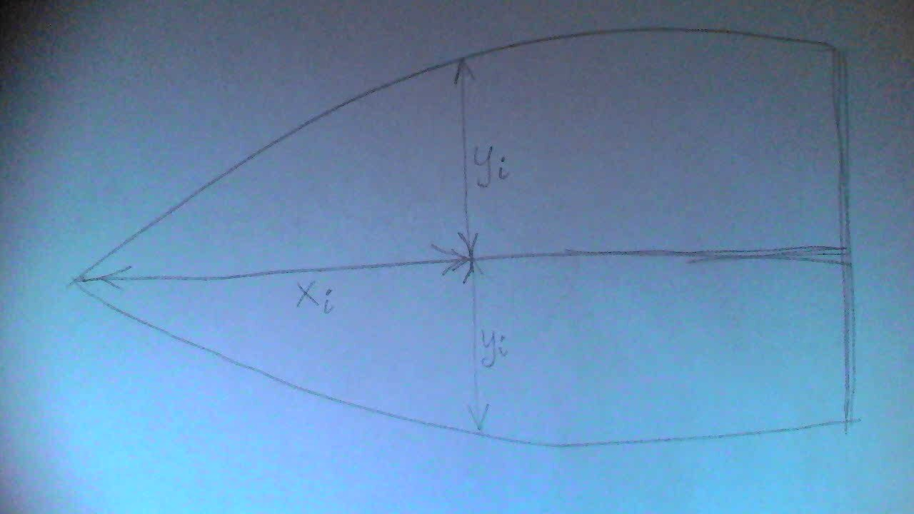
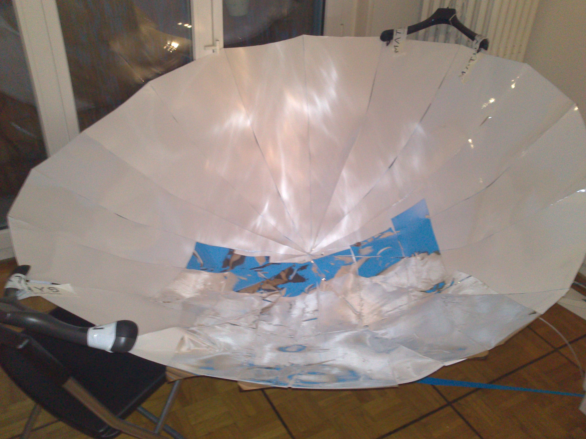
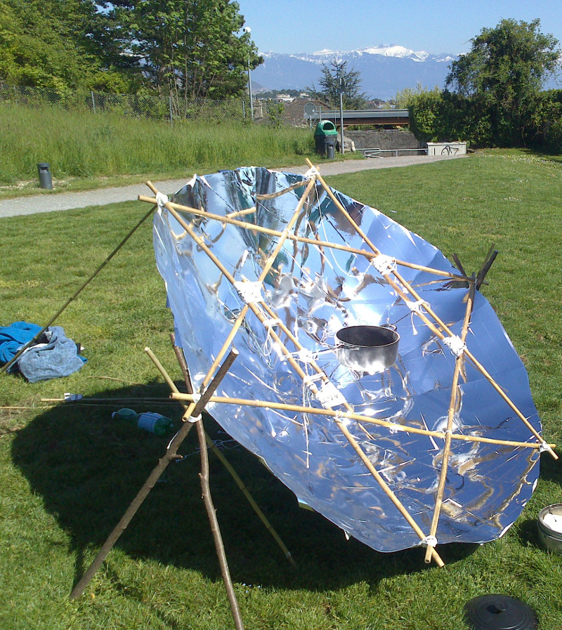
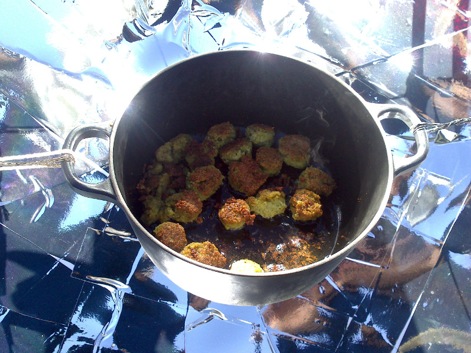

# parabolic

A Clojure library for making parabolas for solar cooking using cardboard segments. This code
calculates the shapes of those segments.

## Usage

Call 
```
(disp-segment (make-parabolic-segment {}))
```
to generate a table of measurements, such as
```
Number of segments: 16
Area: 2.01
Radius: 0.80
Thickness: 0.40
Length of inner triangular frame side: 1.386
X:    0.000   Y:    0.000
X:    0.042   Y:    0.008
X:    0.084   Y:    0.016
X:    0.127   Y:    0.025
X:    0.170   Y:    0.033
X:    0.213   Y:    0.041
X:    0.257   Y:    0.049
X:    0.301   Y:    0.058
X:    0.347   Y:    0.066
X:    0.393   Y:    0.074
X:    0.440   Y:    0.082
X:    0.488   Y:    0.090
X:    0.537   Y:    0.099
X:    0.587   Y:    0.107
X:    0.639   Y:    0.115
X:    0.692   Y:    0.123
X:    0.746   Y:    0.131
X:    0.802   Y:    0.140
X:    0.859   Y:    0.148
X:    0.918   Y:    0.156
```
Here, the area is the area of the boundary circle of the parabola, which is proportional to the amount of sunlight coming in. Radius is the radius of that circle. Thickness is the depth of the parabola. Then come the measurements.

The measurements apply as in this image


Here is the parabola under construction

As reflective material, I used **d-c-fix** (http://www.d-c-fix.com/hochglanz-4606.html).

The final parabola being used...


...to fry falafel.


## License

Copyright © 2016 Jonas Östlund

Distributed under the Eclipse Public License either version 1.0 or (at
your option) any later version.
